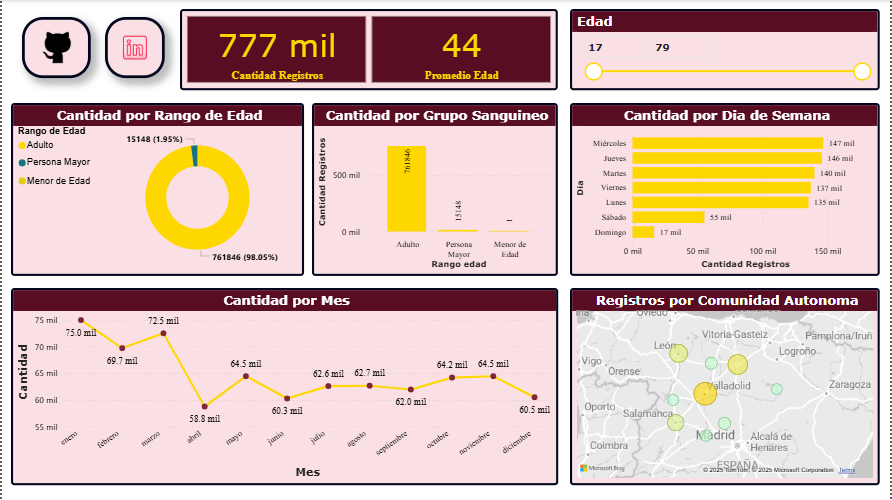
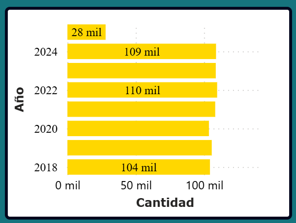
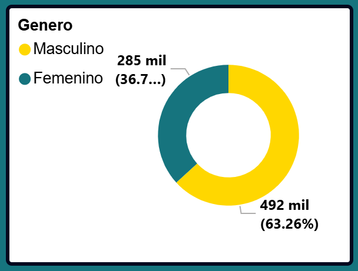
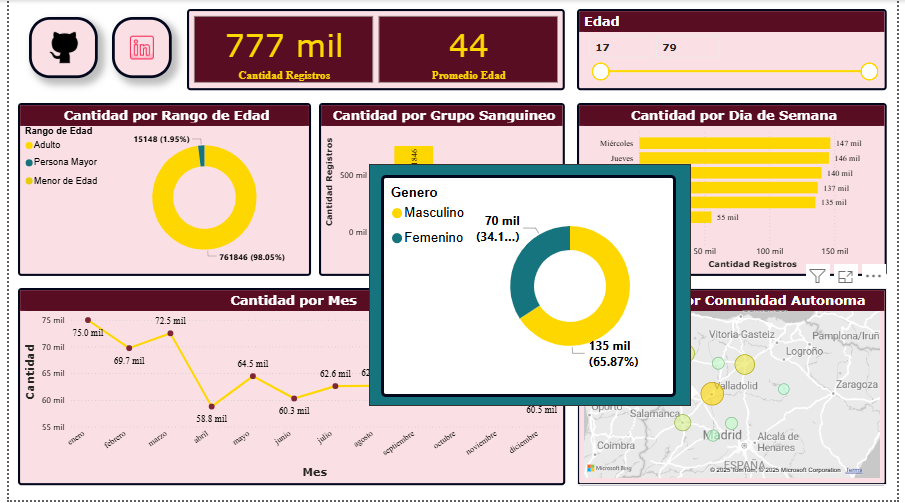
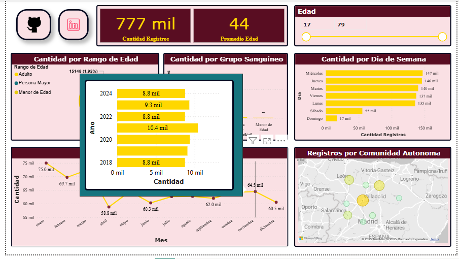

# Proyecto de Visualización de Datos: Donaciones de Sangre en Castilla y León, España

## Descripción

Este proyecto tiene como finalidad analizar y visualizar los datos relacionados con las donaciones de sangre en Castilla y León, España. Para ello, se utiliza el siguiente conjunto de datos abierto proporcionado por la Junta de Castilla y León:

**[DATASET](https://analisis.datosabiertos.jcyl.es/explore/dataset/donaciones-de-sangre-y-aferesis/information/)**

> ***Nota:** Si deseas utilizar este proyecto en tu propio equipo, recuerda que la ruta al archivo del dataset puede ser diferente.  
> Asegúrate de **actualizar** la ruta del archivo en Power BI en el parametro **ruta** para que apunte a la ubicación correcta dentro de tu sistema local.*

## Objetivo

El principal objetivo de este proyecto es demostrar habilidades en análisis y visualización de datos utilizando la herramienta **Power BI**.  
A través de distintas visualizaciones interactivas, se busca representar el comportamiento y evolución de las donaciones de sangre en la comunidad autónoma de Castilla y León, facilitando así la comprensión de patrones, tendencias y posibles áreas de mejora.

## Contenido

### Pagina de Estadisticas

### Tooltips

