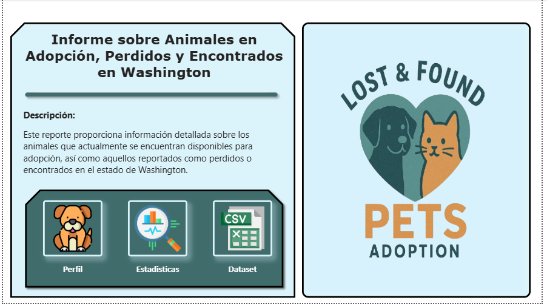

# Proyecto de Visualización de Datos: Animales en Adopción, Perdidos y Encontrados en Washington

## Descripción

Este reporte proporciona información detallada sobre los animales que actualmente se encuentran disponibles para adopción, así como aquellos reportados como perdidos o encontrados en el estado de Washington.
La informacion utilizada pertenece a los datos abiertos de data.gov

**[DATASET](https://catalog.data.gov/dataset/lost-found-adoptable-pets)**

> ***Nota:** Si deseas utilizar este proyecto en tu propio equipo, recuerda que la ruta al archivo del dataset puede ser diferente.  
> Asegúrate de **actualizar** la ruta del archivo en Power BI en el parametro **ruta** para que apunte a la ubicación correcta dentro de tu sistema local.*

## Contenido

### Pagina de Inicio

### Pagina de Perfil

### Pagina de Estadisticas

