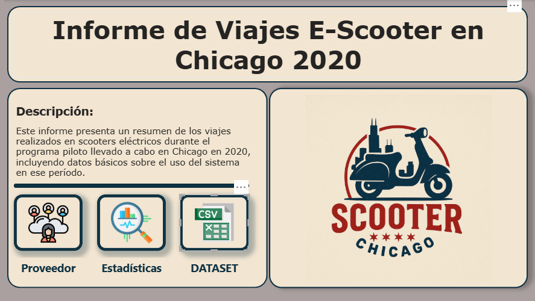
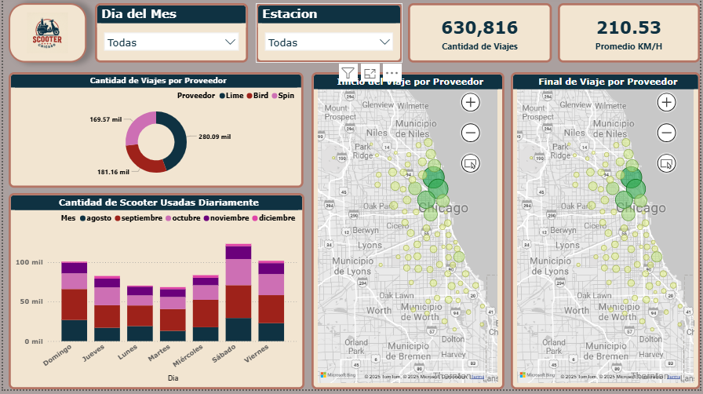
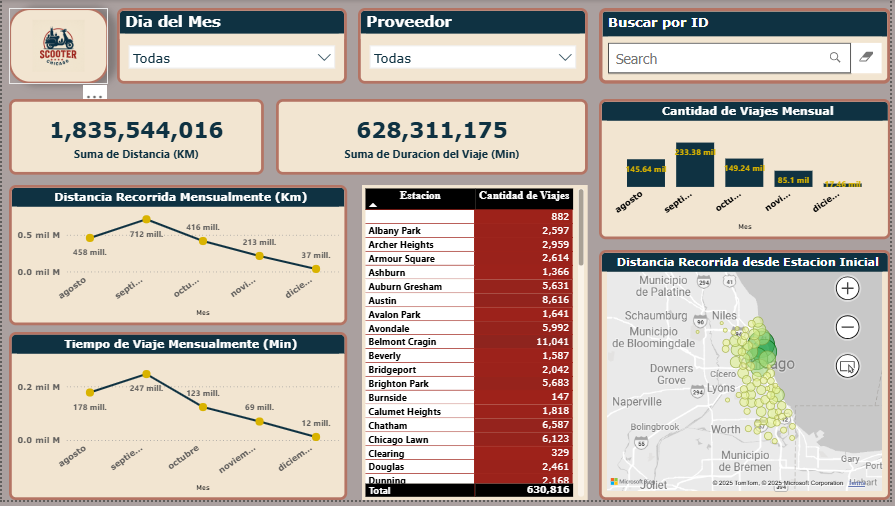
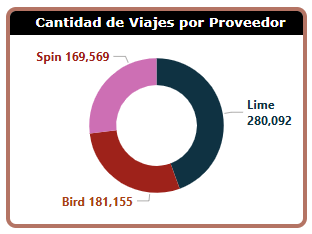
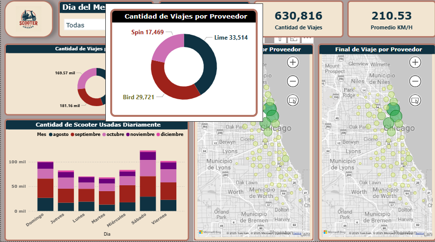
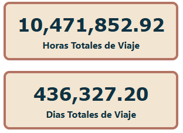
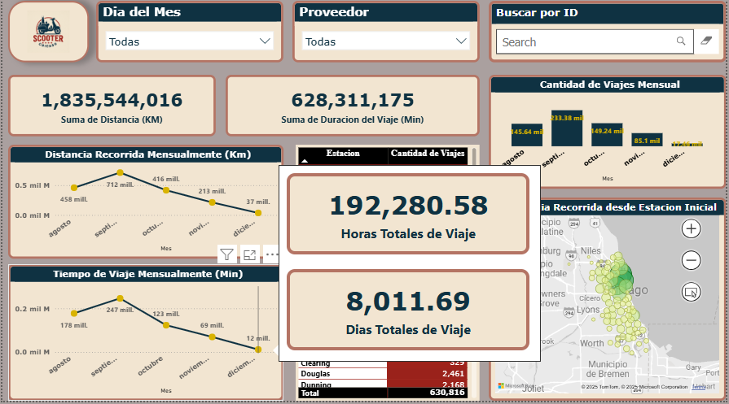

# Proyecto de Visualización de Datos: Programa Piloto de E-Scooters en Chicago, 2020

## Descripción

Este reporte proporciona información detallada sobre los E-scooters en uso en la ciudad de Chicago en el año 2020 durante su programa piloto. Se muestra informacion como ser Proveedores, cantidad de viajes, distancia recorrida, velocidad media y tiempo de uso asi como las ubicaciones de salida y llegada. La informacion utilizada pertenece a los datos abiertos de data.gov

**[DATASET](https://catalog.data.gov/dataset/e-scooter-trips-2020)**

> ***Nota:** Si deseas utilizar este proyecto en tu propio equipo, recuerda que la ruta al archivo del dataset puede ser diferente.Puedes descomprimir el archivo en la carpeta data o descargarlo desde la url.
> Asegúrate de **actualizar** la ruta del archivo en Power BI en el parametro **ruta** para que apunte a la ubicación correcta dentro de tu sistema local.*

## Contenido

### Pagina de Inicio

### Pagina de Proveedores

### Pagina de Estadisticas

### Tooltips

