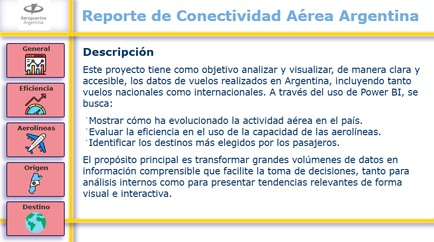
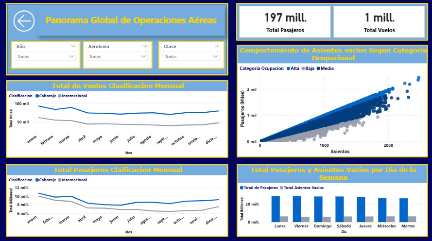
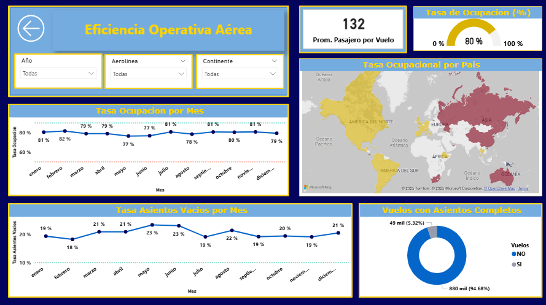
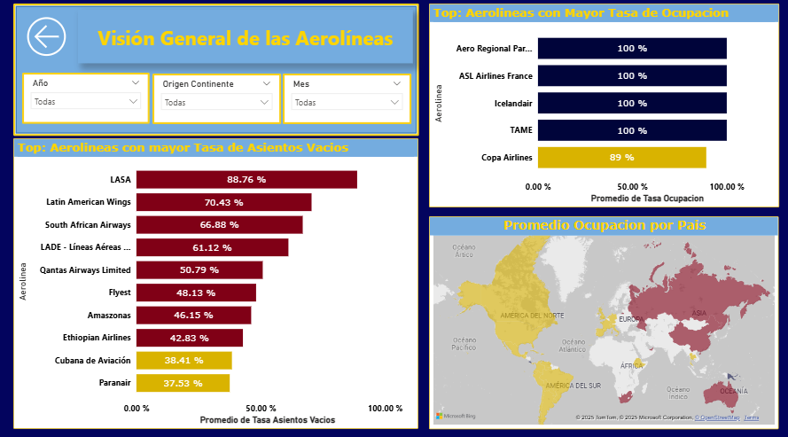
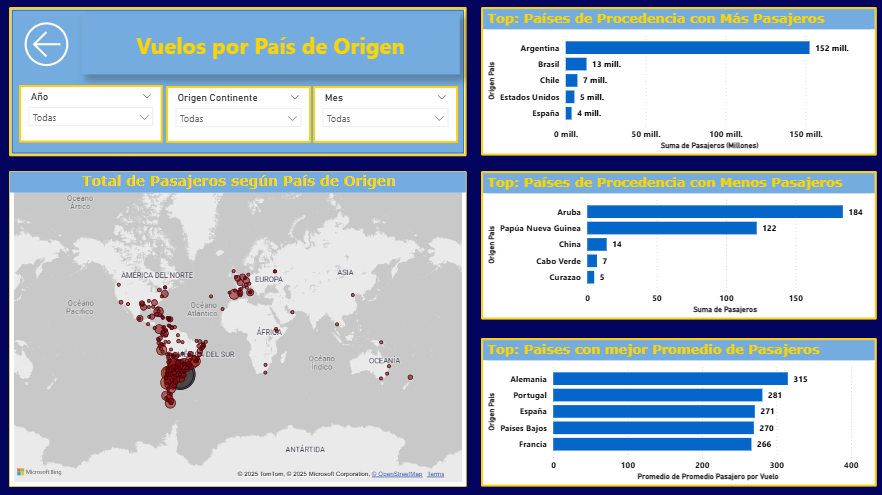
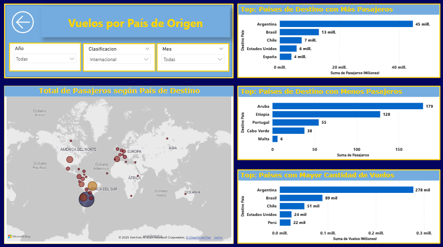
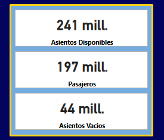
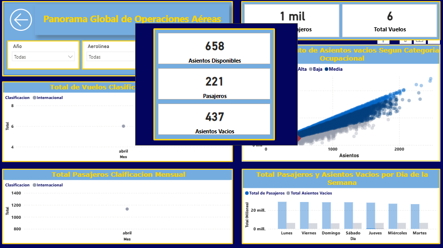
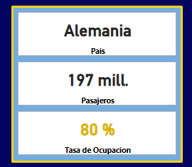
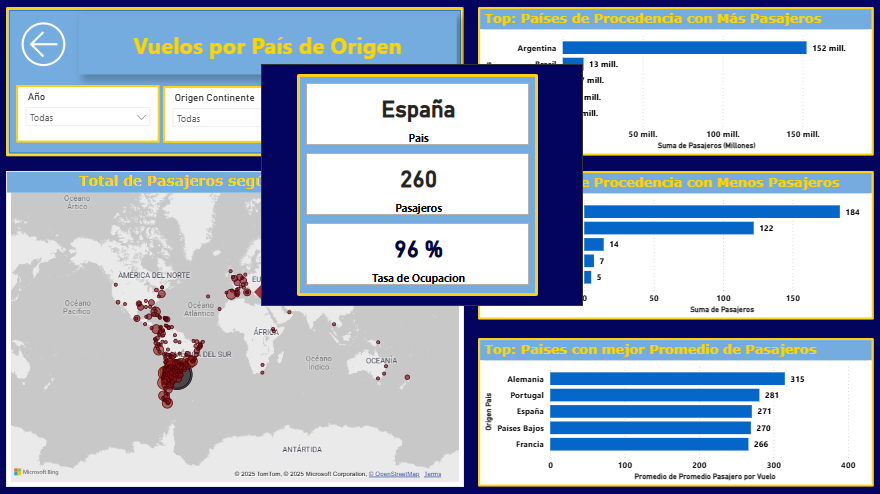

# Proyecto de Visualización de Datos: Programa Piloto de E-Scooters en Chicago, 2020

## Descripción

Este proyecto tiene como objetivo analizar y visualizar, de manera clara y accesible, los datos de vuelos realizados en Argentina, incluyendo tanto vuelos nacionales como internacionales. A través del uso de Power BI, se busca:

- Mostrar cómo ha evolucionado la actividad aérea en el país.
- Evaluar la eficiencia en el uso de la capacidad de las aerolíneas.
- Identificar los destinos más elegidos por los pasajeros.

**[DATASET](https://datos.gob.ar/dataset/turismo-conectividad-aerea)**

> ***Nota:** Si deseas utilizar este proyecto en tu propio equipo, recuerda que la ruta al archivo del dataset puede ser diferente.Puedes descomprimir el archivo en la carpeta data o descargarlo desde la url.
> Asegúrate de **actualizar** la ruta del archivo en Power BI en el parametro **ruta** para que apunte a la ubicación correcta dentro de tu sistema local.*

## Contenido

### Pagina de Inicio

### Informacion General

### Informacion de Eficiencia

### Informacion de Aerolineas

### Informacion de Vuelos de Origen

### Informacion de Vuelos de Destino

### Tooltips

